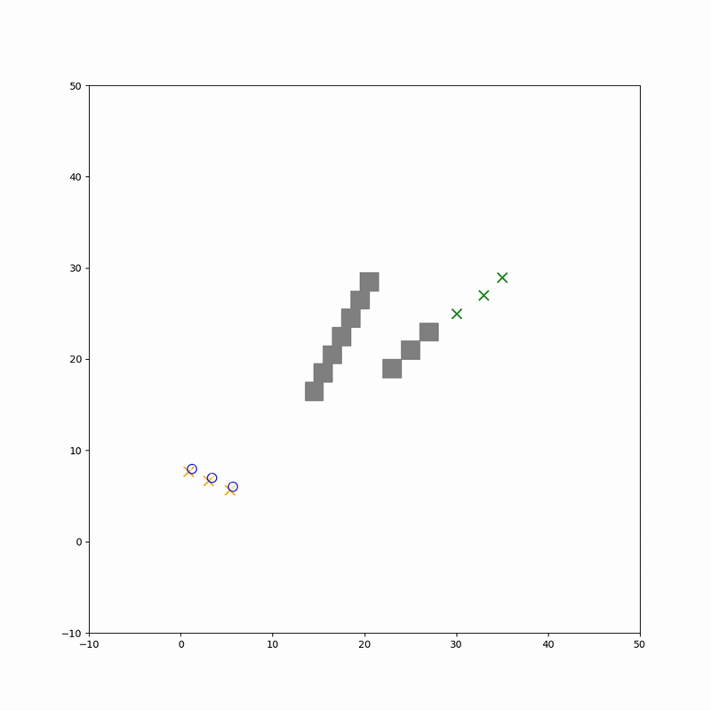
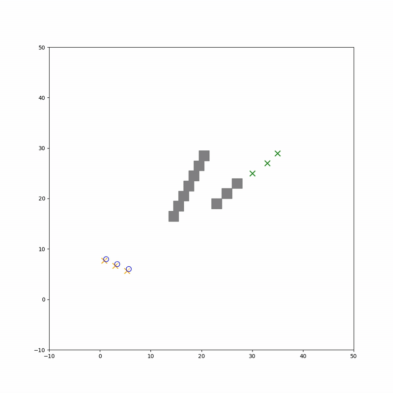
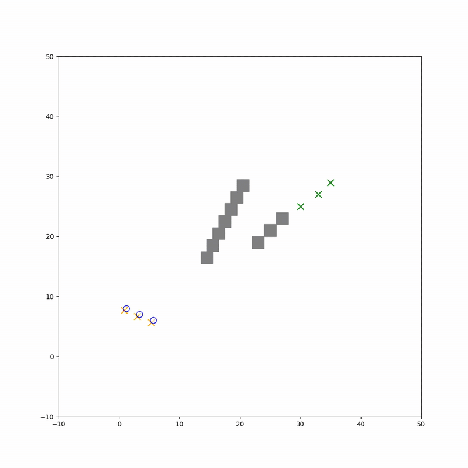

##### All Target-Victim Pairs

**Result:** All Target-Victim Pairs

<table>
  <tr>
    <th>Victim=Robot 0 and Target=Robot 1</th>
    <th>Victim=Robot 0 and Target=Robot 2</th>
  </tr>
  <tr>
    <td>
      
    </td>
    <td>
      
    </td>
  </tr>
</table>

<table>
  <tr>
    <th>Victim=Robot 1 and Target=Robot 0</th>
    <th>Victim=Robot 2 and Target=Robot 1</th>
  </tr>
  <tr>
    <td>
      
    </td>
    <td>
      
    </td>
  </tr>
</table>
